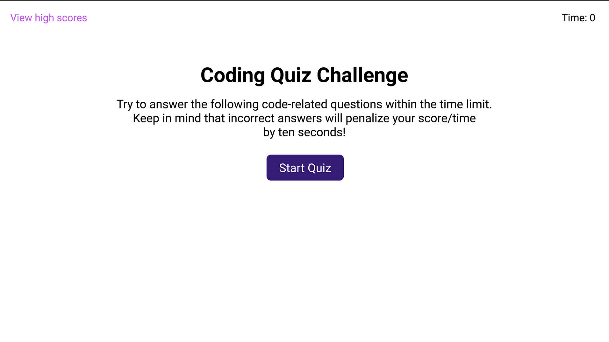
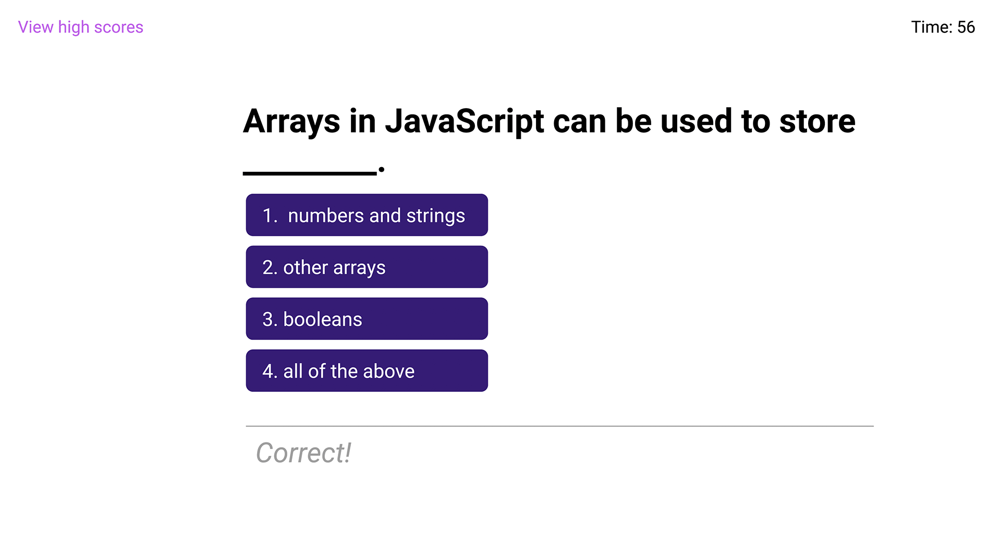
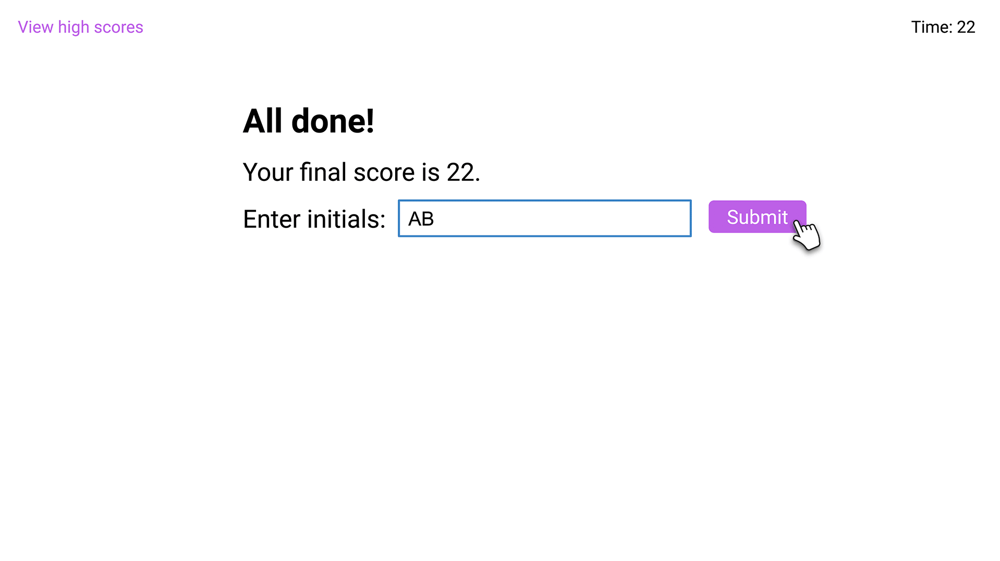
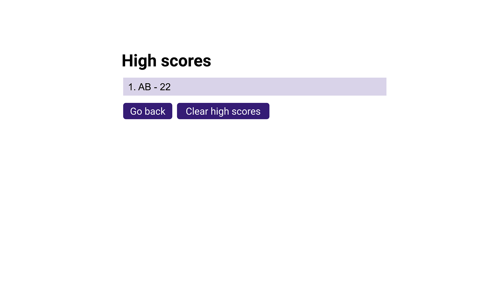
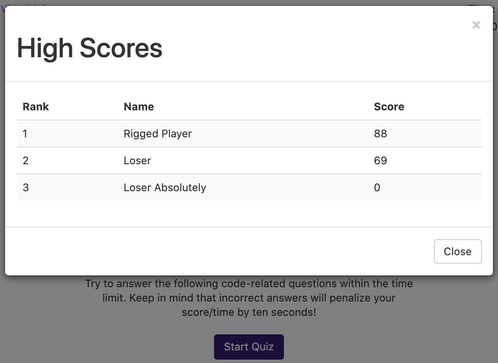

Javascript Quiz Game
===
Made by Weng Fei Fung. A quiz app that gives you a time limit based on how many questions there are. You get penalized 10 seconds everytime you answer wrong. It saves player names and scores.

Play
---
[Game is here](https://siphon880gh.github.io/js-quiz-game/).

Technology used
---
- CSS3
- HTML5
- NPM
- Compass (SCSS)
- Livereload
- Moment Library
- Duration Plugin for Moment Library
- Handlebar JS
- Bootstrap
- Weng's Quick Tester (For testing code)

Screenshots
---
### Starting

### Question

### Finishing 1 of 2

### Finishing 2 of 2

### Ranking
